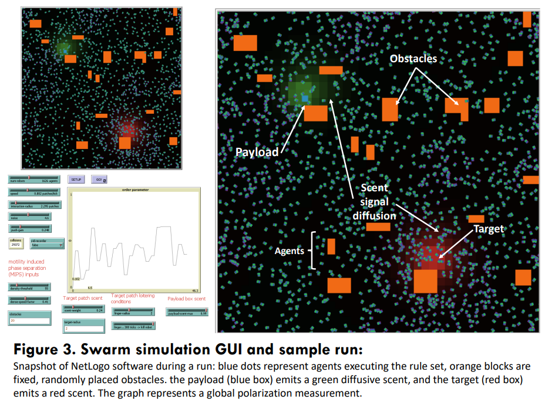
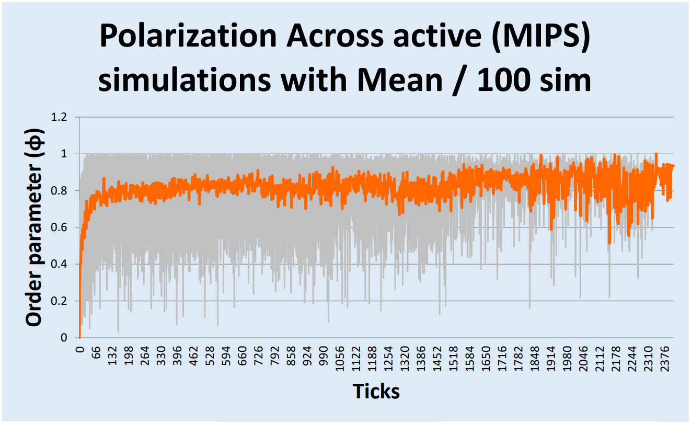
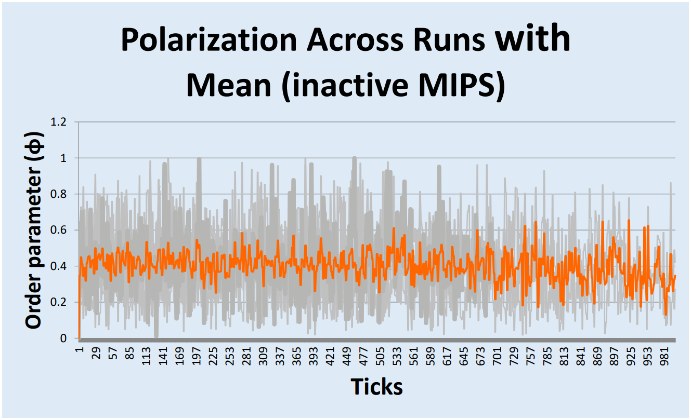

For this research project, I presented a model which exhibits swarming behaviour generated from local interations. For example, each of the "turtles" seen in the simulation can only detect ceirtain parameters such as collective orientation of its neighbours, scent strength and neighbour density. the local rules that govern the turtles behaviour are based on a paper proposed by vicsek et al. and are commonly known as vicsek alignment. The goal of my model was to transport a payload to a target using only the collective push of the turtles. To do so I borrowed concepts from active matter physics as well as biological behaviours seen in Fire ants (MIPS). In the end this model was able to accomplish its goal, while also demonstrating that swarm dynamics can be controlled without hard coding a restrictive set of interaction rules. 

   
  <em>Fig. 2. observed phase separation over high density clusters </em>

In Fig. 2 we can observe an instance of motility induced phase separation (MIPS), a behaviour that is observed in fire ants clusters, heards of wildebeest during migration, active matter physics (Janus colloids) and more throught nature. It is an emergent property of the system and it is basicaly a change of phase from an isotropic to anisotropic due to change in density of a cluster of agents. In other words, It allows clusters of agents to be loosely bound to its neighbours as long as density remains over some threshold. It is important to note that since density is not fixed, the agents are free to enter or leave clusters at any time. 
Comparing runs with active versus suppressed MIPS suggests that motility induced phase separation plays a critical role in successful payload delivery.
Vicsek alignment by itself can deliver the payload, but it does so by stochastic clustering. When MIPS works together with weak chemotactic signals
the agents form polarized flocs almost immediately, yielding higher success rates and shorter completion times.

   
  <em>Fig 4. polarization parameter with active MIPS</em>

   
  <em>Fig 4. polarization parameter when density interactions are not active</em>

This research is significant because the topic of emergence can be applied to a broad range of fields and can be used to better understand emergent behaviours in a system. 
The recent increased usage of autonomous unmaned aerial systems in modern warefare indicates that systems which are self reliant will be of high importance. This research provides a demonstrantion of how a set of basic rules can make a system acomplish a predetermined goal.

### The entire raw data as well as the Netlogo model can be found in this <a href="https://github.com/eliasreyess/Swarm-Payload-Transport-Research-project-">GitHub repository.</a>

  

